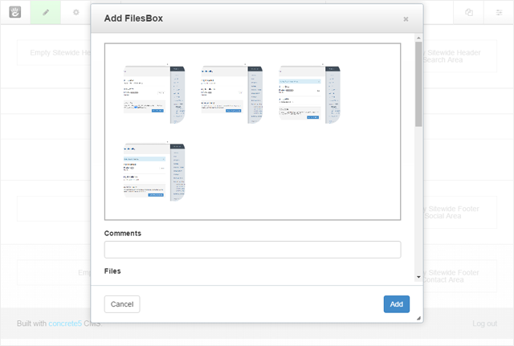
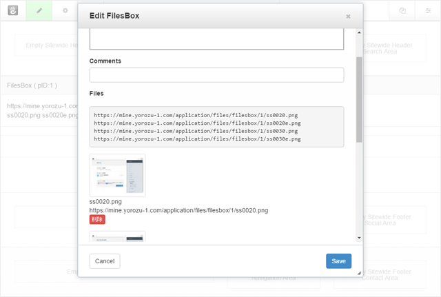
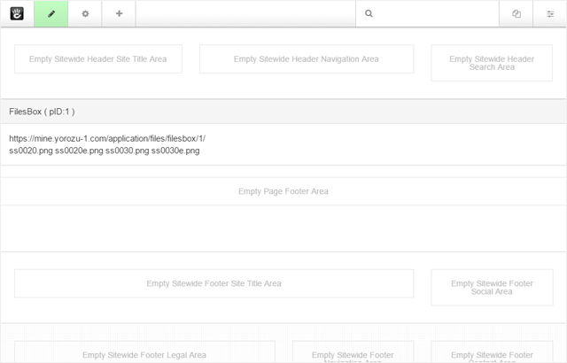
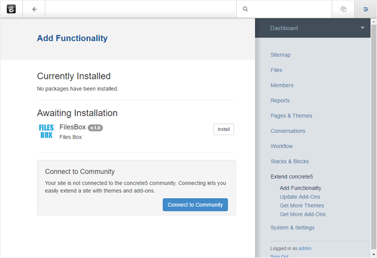
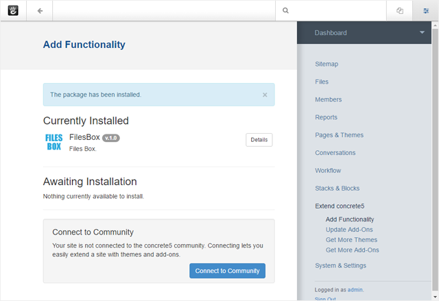
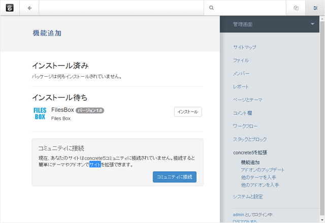
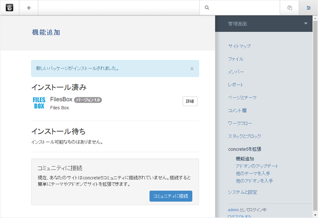

# FilesBox for concrete5.7

For each concrete5 page , you can manage files.

You can upload files by dragging and dropping them.

Uploaded files will be listed.

In the editing screen , you can see saved folder and files listed.

## Introduction

Some files are difficult to find in standard file managers, so this block was created to see each file by page to easily upload files use the dropzone.The instructions to upload are as follows.

dropzone  
HP : [hhttp://www.dropzonejs.com/](http://www.dropzonejs.com/)  

### How to install

#### 1.Upload package files.

Upload the downloaded file to the '/packages' folder of concrete5.

#### 2.Install the package.

The installation waiting , you can see the FilesBox. Please install and click Install.

#### 3.Completion of installation.

When the installation is successful , it will be displayed on the installed.Now available.

#### 4.Drag and drag the FilesBox block into the global area.

Uploaded files are managed on a page-by-page basis.

----

ファイルをドラッグ＆ドロップでアップロードできます。

アップロードしたファイルは、一覧で見ることが可能です。

編集画面では、登録されているファイルの保存フォルダと、ファイルの一覧が表示されます。

## はじめに

標準のファイルマネージャーだと、ページで使われているファイルを探すのが難しくなる場合があるので、ページごとにファイルを管理するブロックを作成しました。ファイルアップロードには、dropzone を利用しています。

dropzone  
HP : [hhttp://www.dropzonejs.com/](http://www.dropzonejs.com/)  

### インストール方法

#### 1.package ファイルをアップロード

ダウンロードしたファイルを concrete5 の /packages フォルダにアップロードします。

#### 2.package をインストールします

インストール待ちに、FilesBox が表示されています。[インストール]をクリックしてインストールしてください。

#### 3.インストールの完了

インストールが成功すると、インストール済みに表示されます。利用可能になりました。

#### 4.FilesBox ブロックを、グローバルエリアに配置します。

アップロードしたファイルは、ページごとに管理されます。

